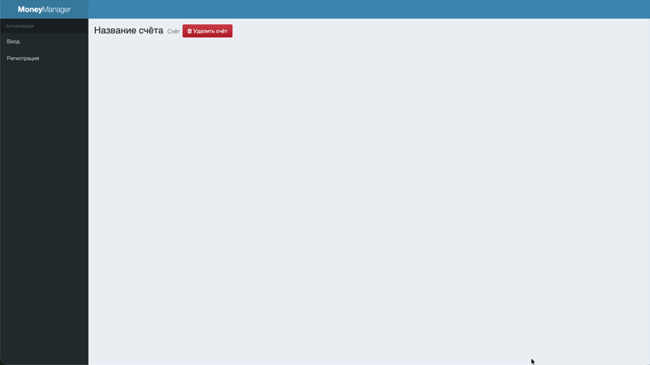
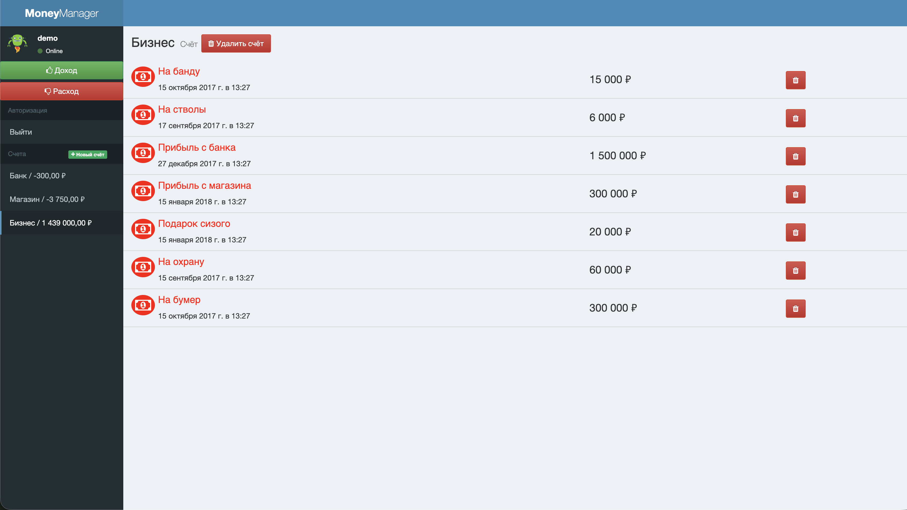
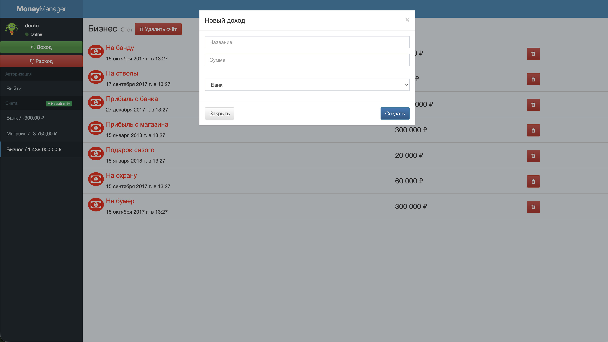
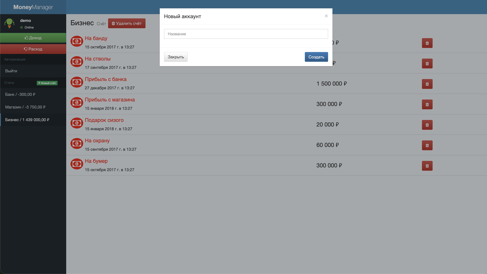

# 💰 Приложение для управления финансами

<div align="center">
  <a href="https://financial-management-app-d3nz.onrender.com"></a>
</div>

<br>

<div align="center">
  
  
  
</div>

<br>

<p align="center">
  <a href="#информация-о-проекте">Информация</a> •
  <a href="#функционал">Функционал</a> •
  <a href="#технологии">Технологии</a> •
  <a href="#установка-и-запуск">Установка и запуск</a> •
  <a href="#тестовые-пользователи">Тестовые пользователи</a>
  <br>  
  <a href="#реализация">Реализация</a> •
  <a href="#серверные-маршруты">Серверные маршруты</a> •
  <a href="#структура-проекта">Структура проекта</a> •
  <a href="#ui-и-демонстрация">UI и демонстрация</a>
</p>

<br>

Учебное SPA-приложение для учёта личных финансов.

Пользователь может зарегистрироваться, войти в приложение, создать счёт, добавить доход или расход, посмотреть список транзакций по выбранному счёту и удалить счёт или отдельную транзакцию.

Проект выполнен как итоговая работа по модулю «Базовый JavaScript в браузере» от Нетологии. Основная задача проекта — реализовать JavaScript-логику для готовой HTML- и CSS-разметки, связать интерфейс с серверным API и обновлять данные на странице без перезагрузки.

<br>

<div align='center'>

</div>

<br>

## Информация о проекте

- **Год:** 2026
- **Статус:** учебный проект
- **Тип:** SPA-приложение
- **Курс:** «Базовый JavaScript в браузере», Нетология
- **Моя часть:** клиентская логика, работа с API, формы, модальные окна, виджеты, отображение данных
- **Демо:** [financial-management-app-d3nz.onrender.com](https://financial-management-app-d3nz.onrender.com)

<br>

## Функционал

- регистрация нового пользователя;
- авторизация пользователя;
- выход из приложения;
- получение текущего пользователя;
- отображение имени авторизованного пользователя;
- создание нового счёта;
- отображение списка счетов;
- отображение суммы по каждому счёту;
- выбор счёта из бокового меню;
- отображение транзакций выбранного счёта;
- создание дохода;
- создание расхода;
- удаление транзакции;
- удаление счёта;
- удаление связанных транзакций при удалении счёта;
- форматирование сумм;
- форматирование даты транзакции;
- отправка данных на сервер без перезагрузки страницы.

<br>

## Технологии

### Основная работа:

**JavaScript** — клиентская логика приложения;
<br>
**DOM API** — работа с элементами страницы и событиями;
<br>
**XMLHttpRequest** — отправка запросов на сервер;
<br>
**FormData** — сбор и отправка данных форм;
<br>
**localStorage** — хранение данных текущего пользователя на клиенте.

### Интерфейс:

- **HTML5** — готовая разметка;
- **CSS3** — стили приложения;
- **Bootstrap 3** — базовые UI-компоненты;
- **AdminLTE** — шаблон интерфейса;
- **Font Awesome** — иконки;
- **Ionicons** — иконки.

### Серверная часть:

- **Node.js** — запуск сервера;
- **Express** — сервер и маршруты API;
- **lowdb** — локальная JSON-база данных;
- **cookie-session** — хранение пользовательской сессии;
- **cookie-parser** — работа с cookie;
- **multer** — обработка данных форм;
- **dotenv** — переменные окружения;
- **morgan** — логирование запросов;
- **uniqid** — генерация идентификаторов.

<br>

## Установка и запуск

### Установка

1. Клонируйте репозиторий:

```bash
git clone https://github.com/potykalov/financial-management-app.git
```
2. Перейдите в папку проекта:

```bash
cd financial-management-app
```

3. Установите зависимости:

```bash
npm install
```

<br>

### Локальный запуск

1. Запустите сервер:

```bash
npm start
```

2. После запуска в терминале должно появиться сообщение:

```bash
Server started at 8000
```

3. Откройте проект в браузере:

```text
http://localhost:8000
```

4. Для остановки сервера нажмите:

```text
Ctrl + C
```

<br>

## Тестовые пользователи

При первом запуске, если в базе данных нет пользователей, сервер создаёт демо-данные.

| Email | Пароль |
|---|---|
| `demo@demo` | `demo` |

Также можно зарегистрировать нового пользователя через форму регистрации.

<br>

## Реализация

В рамках проекта реализована логика клиентской части и взаимодействие с серверным API.

### Работа приложения

- создана инициализация приложения через класс `App`;
- настроены состояния приложения для гостя и авторизованного пользователя;
- реализована работа бокового меню;
- реализовано открытие и закрытие модальных окон;
- реализована отправка форм без перезагрузки страницы;
- реализовано обновление виджетов и страницы транзакций после изменений.

### Работа с пользователем

- реализована регистрация пользователя;
- реализована авторизация пользователя;
- реализован выход из приложения;
- реализовано получение текущего пользователя с сервера;
- данные текущего пользователя сохраняются в `localStorage`;
- имя пользователя отображается в боковой панели.

### Работа со счетами

- реализовано получение списка счетов;
- реализовано создание нового счёта;
- реализовано удаление счёта;
- при удалении счёта удаляются связанные с ним транзакции;
- cумма по счёту рассчитывается на сервере на основе доходов и расходов;
- список счетов обновляется после создания, удаления и изменения транзакций.

### Работа с транзакциями

- реализовано получение транзакций выбранного счёта;
- реализовано создание дохода;
- реализовано создание расхода;
- реализовано удаление транзакции;
- список транзакций обновляется после изменений;
- дата транзакции форматируется через `Intl.DateTimeFormat`;
- суммы форматируются через `toLocaleString`.

### Работа с API

- запросы вынесены в функцию createRequest;
- для GET-запросов параметры добавляются в query string;
- для остальных запросов данные отправляются через FormData;
- API-классы разделены по сущностям:
   - `User`;
   - `Account`;
   - `Transaction`;
   - `Entity`.

<br>

## Серверные маршруты

| Метод | Маршрут | Назначение |
|---|---|---|
| `POST` | `/user/register` | регистрация пользователя |
| `POST` | `/user/login` | авторизация пользователя |
| `POST` | `/user/logout` | выход из приложения |
| `GET` | `/user/current` | получение текущего пользователя |
| `GET` | `/account` | получение списка счетов |
| `PUT` | `/account` | создание счёта |
| `DELETE` | `/account` | удаление счёта |
| `GET` | `/transaction` | получение списка транзакций |
| `PUT` | `/transaction` | создание транзакции |
| `DELETE` | `/transaction` | удаление транзакции |

<br>

## Структура проекта

```text
financial-management-app/
├── public/
│   ├── index.html                         — основная HTML-страница
│   ├── app.css                            — стили приложения
│   ├── js/
│   │   ├── api/                           — классы и функция для работы с API
│   │   │   ├── Account.js
│   │   │   ├── createRequest.js
│   │   │   ├── Entity.js
│   │   │   ├── Transaction.js
│   │   │   └── User.js
│   │   └── ui/                            — классы интерфейса
│   │       ├── forms/                     — формы приложения
│   │       │   ├── AsyncForm.js
│   │       │   ├── CreateAccountForm.js
│   │       │   ├── CreateTransactionForm.js
│   │       │   ├── LoginForm.js
│   │       │   └── RegisterForm.js
│   │       ├── pages/                     — динамическая страница транзакций
│   │       │   └── TransactionsPage.js
│   │       ├── widgets/                   — виджеты боковой панели
│   │       │   ├── AccountsWidget.js
│   │       │   ├── TransactionsWidget.js
│   │       │   └── UserWidget.js
│   │       ├── Modal.js
│   │       └── Sidebar.js
│   ├── resources/
│   ├── test/
│   └── vendor/
│       └── adminlte/
├── routes/                                — серверные маршруты
│   ├── account.js
│   ├── index.js
│   ├── transaction.js
│   └── user.js
├── db.json                                — локальная база данных
├── index.js                               — точка входа сервера
├── package.json                           — зависимости и npm-скрипты
├── .env                                   — настройки локального запуска
├── LICENSE
└── README.md
```

<br>

## UI и демонстрация

### Главный экран приложения

<div align="center">
  
</div>

<br>

### Создание дохода

<div align="center">
  
</div>

<br>

### Создание расхода

<div align="center">
  
</div>

<br>

### Создание нового счета

<div align="center">
  
</div>

<br>

## Лицензия

Проект распространяется под лицензией MIT.

Подробнее см. файл [LICENSE](LICENSE).

<br>

## Автор

<div align="center"> <p> <strong>Дмитрий Потыкалов</strong><br> Frontend-разработчик </p>

<a href="https://github.com/potykalov"></a>
<a href="mailto:dmitriy.potykalov@gmail.com"></a>
<a href="https://t.me/dmitriy_potykalov"></a>
<a href="https://www.linkedin.com/in/potykalov"></a>

</div>
