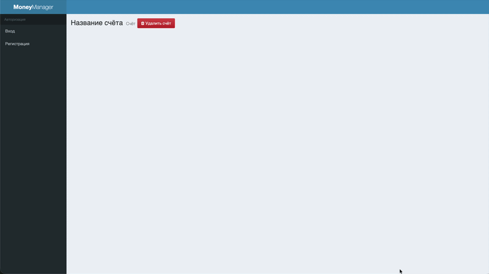
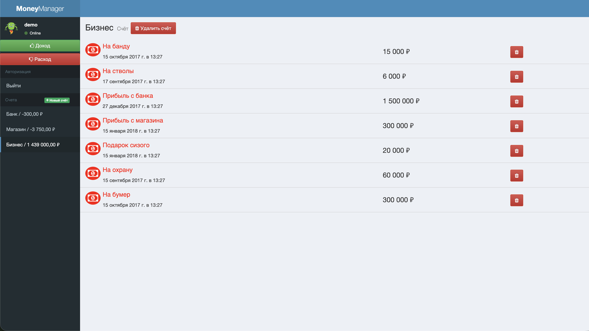
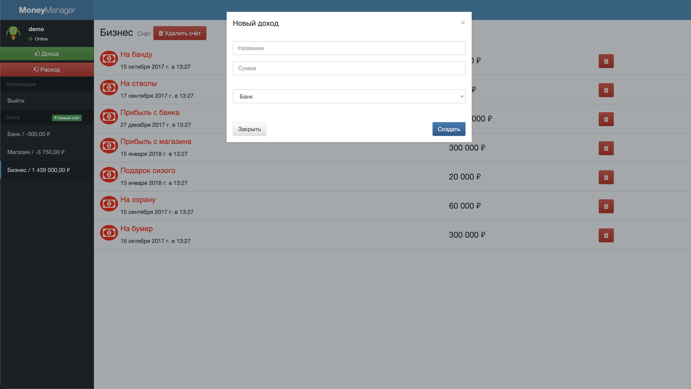
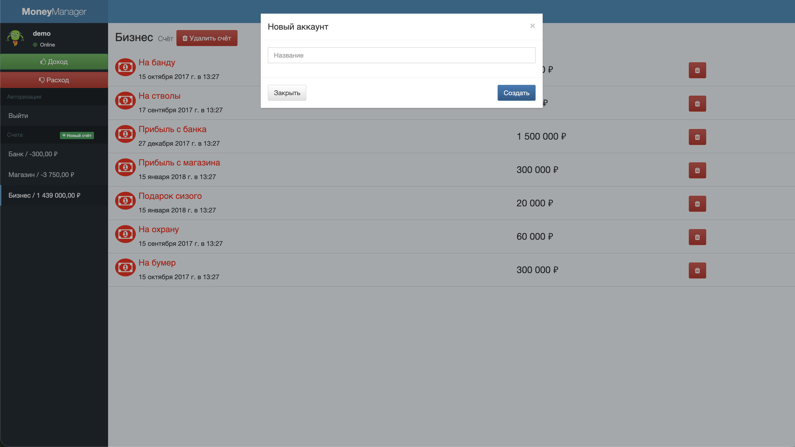

# 💰 Financial Management App — приложение для учёта личных финансов

**Financial Management App** — учебное SPA-приложение на JavaScript для учёта личных финансов.

Пользователь может зарегистрироваться, создать несколько счетов, добавлять доходы и расходы, просматривать историю транзакций и отслеживать текущий баланс каждого счёта.

Приложение взаимодействует с серверным API и обновляет финансовые данные без полной перезагрузки страницы.

Проект выполнен индивидуально в рамках итоговой работы по модулю **«Базовый JavaScript в браузере»** Нетологии.

<p align="center">
  <a href="https://financial-management-app-d3nz.onrender.com"></a>
  <a href="LICENSE"></a>
</p>

<p align="center">
  
</p>

## Содержание

- [О проекте](#о-проекте)
- [Мой вклад](#мой-вклад)
- [Функциональность](#функциональность)
- [Технические решения](#технические-решения)
- [Технологии](#технологии)
- [Установка и запуск](#установка-и-запуск)
- [Структура проекта](#структура-проекта)
- [Тестирование](#тестирование)
- [Результат](#результат)
- [Скриншоты](#скриншоты)
- [Лицензия](#лицензия)
- [Автор](#автор)

---

## О проекте

Financial Management App — индивидуальный учебный проект, выполненный на основе [дипломного задания Нетологии](https://github.com/netology-code/bhj-diploma).

В исходном шаблоне были предоставлены:

- HTML- и CSS-разметка приложения.
- Готовый класс `App`, отвечающий за инициализацию компонентов и управление состояниями интерфейса.
- Структура клиентской части с разделением на API, формы, страницы и виджеты.
- Заготовки классов с описанием методов, которые необходимо реализовать.
- Серверная часть на Node.js и Express с локальной JSON-базой данных.

**Моя задача** — реализовать недостающую JavaScript-логику клиентской части, связать интерфейс с серверным API и обеспечить выполнение пользовательских операций без полной перезагрузки страницы.

В ходе работы реализовал обработку регистрации и авторизации, управление счетами и транзакциями, отправку форм, работу модальных окон и динамическое отображение финансовых данных.

Основной акцент проекта — работа с JavaScript, DOM API, HTTP-запросами, классами и обработкой событий браузера.

## Мой вклад

### 1. Взаимодействие с серверным API

Реализовал отправку асинхронных HTTP-запросов с помощью `XMLHttpRequest`.

- Реализовал функцию `createRequest` для отправки запросов и обработки ответов сервера.
- Добавил передачу параметров GET-запросов через `URLSearchParams`.
- Реализовал отправку данных в теле запросов с использованием `FormData`.
- Добавил обработку успешных HTTP-ответов и сетевых ошибок через callback-функции.
- Реализовал методы получения, создания и удаления данных в базовом классе `Entity`.
- Реализовал взаимодействие с API пользователей, счетов и транзакций в предусмотренных для этого классах.

### 2. Регистрация и авторизация

Реализовал клиентскую логику работы с пользователями.

- Добавил отправку данных форм регистрации и авторизации на сервер.
- Реализовал получение информации о текущем пользователе через API.
- Добавил сохранение и получение данных текущего пользователя через `localStorage`.
- Реализовал удаление локальных данных пользователя при выходе из приложения.
- Добавил переключение состояний интерфейса после успешной регистрации, авторизации и выхода.
- Реализовал отображение имени авторизованного пользователя в боковой панели.

Проверка учётных данных и управление серверной сессией выполняются предоставленной серверной частью приложения.

### 3. Управление счетами

Реализовал клиентские сценарии работы со счетами:

- Получение и отображение списка счетов пользователя.
- Создание нового счёта через форму.
- Отображение текущего баланса каждого счёта.
- Выбор счёта в боковом меню и загрузку связанных с ним транзакций.
- Удаление счёта после подтверждения пользователя.
- Обновление списка счетов после выполнения операций.

Баланс рассчитывается на сервере на основе доходов и расходов, связанных со счётом.

### 4. Управление транзакциями

Реализовал клиентскую логику создания, отображения и удаления финансовых операций.

- Добавил получение транзакций выбранного счёта через API.
- Реализовал создание операций дохода и расхода.
- Добавил загрузку списка доступных счетов в формы создания транзакций.
- Реализовал динамическое отображение полученных транзакций.
- Добавил удаление транзакций после подтверждения пользователя.
- Реализовал форматирование дат и денежных сумм для отображения в интерфейсе.
- Добавил обновление финансовых данных после создания и удаления транзакций без полной перезагрузки страницы.

### 5. Работа с формами и интерфейсом

На основе предоставленной HTML- и CSS-разметки реализовал:

- Обработку отправки форм без перезагрузки страницы.
- Сбор данных форм с использованием `FormData`.
- Открытие и закрытие модальных окон регистрации, авторизации, создания счетов и транзакций.
- Обработку нажатий на кнопки бокового меню.
- Переключение состояний боковой панели.
- Динамическое формирование HTML-разметки для отображения счетов и транзакций.
- Обновление соответствующих компонентов интерфейса после успешного выполнения запросов.

---

## Функциональность

### Регистрация и авторизация

Пользователь может зарегистрировать новую учётную запись или войти в приложение с существующими данными.

После авторизации становятся доступны операции со счетами и транзакциями.

В боковой панели отображается имя текущего пользователя.

При выходе из приложения интерфейс возвращается в состояние для неавторизованного пользователя.

### Управление счетами

Авторизованный пользователь может создавать несколько счетов для учёта личных финансов.

Каждый счёт содержит название и текущий баланс, рассчитываемый сервером на основе связанных с ним доходов и расходов.

При выборе счёта в боковом меню отображается история его транзакций.

Счёт можно удалить после подтверждения действия.

При удалении счёта сервер также удаляет связанные с ним транзакции.

### Доходы и расходы

Для каждого счёта можно создавать операции двух типов:

- **Доход** — поступление денежных средств.
- **Расход** — списание денежных средств.

При создании транзакции пользователь указывает название операции, сумму и счёт.

После успешного выполнения запроса данные приложения обновляются без полной перезагрузки страницы.

### История транзакций

При выборе счёта отображаются связанные с ним финансовые операции.

Для каждой транзакции выводятся:

- Название операции.
- Дата и время создания.
- Сумма в рублях.
- Кнопка удаления.

Для форматирования даты используется `Intl.DateTimeFormat`, а для отображения денежных сумм — `toLocaleString()`.

---

## Технические решения

### Работа с HTTP-запросами

Для взаимодействия с серверным API реализовал функцию `createRequest` на основе `XMLHttpRequest`.

Функция принимает параметры запроса, формирует URL или тело запроса и передаёт результат выполнения в callback-функцию.

Для GET-запросов параметры преобразуются в строку запроса с помощью `URLSearchParams`.

Для остальных HTTP-методов данные преобразуются в `FormData` и передаются в теле запроса.

Реализована обработка успешных ответов и ошибок HTTP-запросов.

**Реализация:** [createRequest.js](public/js/api/createRequest.js)

### Работа с API через классы

В предусмотренном учебным заданием базовом классе `Entity` реализовал общие методы взаимодействия с сервером:

- `list()` — получение списка данных.
- `create()` — создание новой сущности.
- `remove()` — удаление сущности.

Классы `Account` и `Transaction` наследуются от `Entity` и используют его методы для взаимодействия с соответствующими API-маршрутами.

В классе `User` реализовал методы для регистрации, авторизации, выхода и получения информации о текущем пользователе.

Такой подход позволяет использовать общую логику выполнения HTTP-запросов при работе с разными сущностями приложения.

**Реализация:** [API-классы](public/js/api/)

### Обработка форм без перезагрузки страницы

Реализовал методы базового класса `AsyncForm`, отвечающие за обработку форм приложения.

При отправке формы вызывается `preventDefault()`, отменяющий стандартное поведение браузера.

Данные формы собираются с помощью `FormData` и преобразуются в объект через `Object.fromEntries()`.

Затем данные передаются в метод `onSubmit()`, который реализуется в конкретных классах форм.

После успешного выполнения запроса форма очищается, модальное окно закрывается и обновляются соответствующие данные интерфейса.

**Реализация:** [AsyncForm.js](public/js/ui/forms/AsyncForm.js)

### Динамическое обновление финансовых данных

При создании или удалении транзакции необходимо обновлять не только историю операций, но и отображаемый баланс соответствующего счёта.

Для этого после успешного выполнения запросов используются предусмотренные классом `App` методы обновления страниц, виджетов и форм.

В частности, общий метод `App.update()` инициирует обновление соответствующих компонентов:

```javascript
static update() {
  this.updateWidgets();
  this.updatePages();
  this.updateForms();
}
```

**Важно:** класс `App` и его методы обновления были предоставлены в исходном шаблоне. В рамках проекта реализовал их использование в обработчиках форм и операций с финансовыми данными.

После создания или удаления транзакций приложение повторно запрашивает необходимые данные у сервера и обновляет интерфейс без полной перезагрузки страницы.

**Реализация:** [App.js](public/js/App.js)

### Обработка событий динамических элементов

Список транзакций формируется после получения данных с сервера.

Для обработки нажатий на кнопки удаления использовал делегирование событий.

Обработчик события `click` зарегистрирован на общем контейнере страницы транзакций. С помощью `closest()` определяется, была ли нажата кнопка удаления счёта или транзакции.

Идентификатор выбранной транзакции считывается из атрибута `data-id`, после чего выполняется соответствующий запрос к API.

Это позволяет обрабатывать события элементов, добавленных на страницу после первоначальной загрузки.

**Реализация:** [TransactionsPage.js](public/js/ui/pages/TransactionsPage.js)

### Работа с состоянием авторизации

В классе `User` реализовал сохранение информации о текущем пользователе в `localStorage`.

При открытии приложения выполняется запрос к API для получения информации о текущем авторизованном пользователе.

В зависимости от ответа сервера обновляются локальные данные пользователя и состояние интерфейса.

При выходе из приложения информация о пользователе удаляется из `localStorage`.

Управление серверной сессией выполняется предоставленной серверной частью приложения.

**Реализация:** [User.js](public/js/api/User.js)

---

## Технологии

| Область | Технологии |
| --- | --- |
| Клиентская логика | JavaScript (ES6+), классы, наследование |
| Работа с интерфейсом | DOM API, события браузера |
| Взаимодействие с API | XMLHttpRequest, HTTP, URLSearchParams |
| Работа с формами | FormData |
| Хранение данных пользователя | localStorage |
| Форматирование данных | Intl.DateTimeFormat, toLocaleString |
| Готовый интерфейс | HTML5, CSS3, Bootstrap 3, AdminLTE |
| Серверная часть учебного шаблона | Node.js, Express |
| Хранение серверных данных | lowdb, JSON |

Клиентская часть реализована без сторонних frontend-фреймворков и библиотек управления состоянием.

---

## Установка и запуск

Для локального запуска необходимо установить Node.js и npm.

### 1. Клонируйте репозиторий

```bash
git clone https://github.com/potykalov/financial-management-app.git
```

### 2. Перейдите в каталог проекта

```bash
cd financial-management-app
```

### 3. Установите зависимости

```bash
npm install
```

### 4. Запустите сервер

```bash
npm start
```

После запуска приложение будет доступно по адресу:

http://localhost:8000

Для остановки сервера нажмите `Ctrl + C` в терминале.

### Тестовый пользователь

При первом запуске, если в базе данных отсутствуют пользователи, сервер создаёт демонстрационные данные.

Для проверки приложения можно использовать тестовую учётную запись:

| Email | Пароль |
| --- | --- |
| `demo@demo` | `demo` |

Также можно зарегистрировать нового пользователя через форму регистрации.

Приложение предназначено для учебной демонстрации, а не для хранения реальных финансовых данных.

---

## Структура проекта

```text
financial-management-app/
├── assets/
│   ├── preview.gif
│   ├── main.jpg
│   ├── new-account.jpg
│   ├── new-income.jpg
│   └── new-expense.jpg
│
├── public/
│   ├── index.html
│   ├── app.css
│   │
│   ├── js/
│   │   ├── App.js
│   │   │
│   │   ├── api/
│   │   │   ├── createRequest.js
│   │   │   ├── Entity.js
│   │   │   ├── User.js
│   │   │   ├── Account.js
│   │   │   └── Transaction.js
│   │   │
│   │   └── ui/
│   │       ├── Modal.js
│   │       ├── Sidebar.js
│   │       │
│   │       ├── forms/
│   │       │   ├── AsyncForm.js
│   │       │   ├── LoginForm.js
│   │       │   ├── RegisterForm.js
│   │       │   ├── CreateAccountForm.js
│   │       │   └── CreateTransactionForm.js
│   │       │
│   │       ├── pages/
│   │       │   └── TransactionsPage.js
│   │       │
│   │       └── widgets/
│   │           ├── AccountsWidget.js
│   │           ├── TransactionsWidget.js
│   │           └── UserWidget.js
│   │
│   ├── resources/
│   ├── test/
│   └── vendor/
│
├── routes/
│   ├── index.js
│   ├── user.js
│   ├── account.js
│   └── transaction.js
│
├── index.js
├── db.json
├── package.json
├── LICENSE
└── README.md
```

### Основные компоненты клиентской части

| Файл | Назначение |
| --- | --- |
| [App.js](public/js/App.js) | Предоставленный класс для инициализации приложения и управления состояниями интерфейса |
| [createRequest.js](public/js/api/createRequest.js) | Отправка HTTP-запросов |
| [Entity.js](public/js/api/Entity.js) | Общие методы взаимодействия с API |
| [User.js](public/js/api/User.js) | Клиентская логика регистрации и авторизации |
| [Account.js](public/js/api/Account.js) | Взаимодействие с API счетов |
| [Transaction.js](public/js/api/Transaction.js) | Взаимодействие с API транзакций |
| [AsyncForm.js](public/js/ui/forms/AsyncForm.js) | Базовый класс асинхронных форм |
| [TransactionsPage.js](public/js/ui/pages/TransactionsPage.js) | Отображение и управление транзакциями выбранного счёта |
| [AccountsWidget.js](public/js/ui/widgets/AccountsWidget.js) | Отображение счетов и обработка их выбора |
| [Modal.js](public/js/ui/Modal.js) | Управление модальными окнами |

---

## Тестирование

В исходном учебном шаблоне предусмотрены тесты Jasmine для проверки отдельных компонентов взаимодействия с серверным API.

Тестовые файлы расположены в каталоге:

`public/test/spec/api/`

Они содержат проверки для:

- Функции `createRequest`.
- Базового класса `Entity`.
- Классов `User`, `Account` и `Transaction`.

В текущей конфигурации репозитория команда `npm test` не настроена для запуска этих тестов.

Автоматический запуск тестов через CI и показатели покрытия для данного проекта не заявляются.

---

## Результат

В рамках учебного проекта реализована клиентская JavaScript-логика приложения для учёта личных финансов.

Приложение поддерживает регистрацию и авторизацию пользователей, создание и удаление счетов, учёт доходов и расходов, отображение истории транзакций и динамическое обновление финансовых данных.

В ходе разработки применил:

- Объектно-ориентированное программирование и наследование классов.
- Работу с DOM и обработку событий браузера.
- Асинхронные HTTP-запросы и взаимодействие с серверным API.
- Обработку форм без перезагрузки страницы.
- Делегирование событий для динамически создаваемых элементов.
- Работу с `localStorage` и форматирование данных.

Получил практический опыт реализации клиентской логики в существующей структуре приложения и взаимодействия frontend-части с серверным API.

---

## Скриншоты

### Главный экран приложения

После авторизации пользователь может просматривать счета, их текущие балансы и историю транзакций выбранного счёта.

<p align="center">
  
</p>

### Создание дохода

Через модальное окно пользователь может добавить новую операцию дохода, указав название, сумму и счёт.

<p align="center">
  
</p>

### Создание расхода

Пользователь может добавить расход через отдельную форму с выбором счёта.

<p align="center">
  
</p>

### Создание нового счёта

Новый счёт создаётся через модальное окно. После успешного выполнения запроса список счетов обновляется без перезагрузки страницы.

<p align="center">
  
</p>

---

## Лицензия

Проект распространяется под лицензией [MIT](LICENSE).

Выполнен на основе [дипломного задания Нетологии](https://github.com/netology-code/bhj-diploma).

HTML- и CSS-разметка, серверная часть, структура клиентского приложения, класс `App` и заготовки остальных классов предоставлены в учебном шаблоне.

## Автор

**Дмитрий Потыкалов**

Frontend Developer

[GitHub](https://github.com/potykalov) · [LinkedIn](https://www.linkedin.com/in/potykalov) · [Telegram](https://t.me/dmitriy_potykalov)
